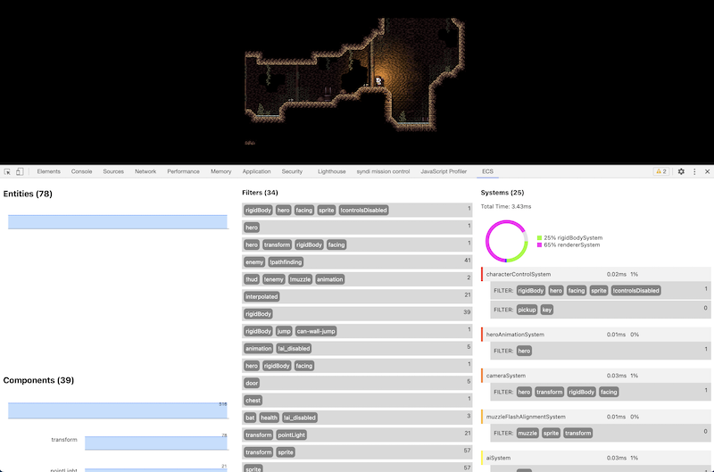
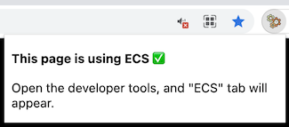

# ecs

data oriented, functional entity component system.

[](https://github.com/mreinstein/ecs/actions/workflows/main.yml)

## what?

Many games and simulations are built around object oriented classes and scene graphs.

Scene graphs and object hierarchies often end up being a mess, where eventually one ends up facing difficult decisions around questions like "where does this particular piece of logic/state live?" There are certain bits of logic/state that cross-cut and don't fit cleanly in one place, and code and logic become entangled in various places in the graph.  Not all relationships in a game/simulation are modeled appropriately with parent/child relationships which is why we get into these situations.


ECS is an alternative architecture:

* **E**ntities have 0 or more components
* **C**omponents are pure data and have no behavior
* **S**ystems have behavior but no data

The entire ecs module here is about 100 lines of code, and offers an O(1) iterator at run time for querying for entities within systems.


## usage example

This is a minimal example of what you can do with `ecs`, illustrating how to declare
your entities, components, and systems.

Requires a modern web browser, or node version `12.17.1` or higher.

```javascript
import ECS      from 'ecs'
import Keyboard from './my/game/keyboard.js'
import clamp    from 'clamp'


// generates a new entity component system
const world = ECS.createWorld()


// set up the player
const PLAYER = ECS.createEntity(world)
ECS.addComponentToEntity(world, PLAYER, 'position', { x: 15, y: 23 })
ECS.addComponentToEntity(world, PLAYER, 'moveable', { dx: 0, dy: 0 })


// update entity velocity based on key pressed
function keyboardControlSystem (world) {
    // called each game loop
    const onUpdate = function (dt) {
        // get all of the entities in the world that pass the filter
        for (const entity of ECS.getEntities(world, [ 'moveable' ])) {
            // update the entity position according to what is pressed
            if (Keyboard.keyPressed('up'))
                entity.moveable.dy -= 1
            if (Keyboard.keyPressed('down'))
                entity.moveable.dy += 1
            if (Keyboard.keyPressed('left'))
                entity.moveable.dx -= 1
            if (Keyboard.keyPressed('right'))
                entity.moveable.dx += 1

           entity.moveable.dx = clamp(entity.moveable.dx, -10, 10)
           entity.moveable.dy = clamp(entity.moveable.dy, -10, 10)
        }
    }

    return { onUpdate }
}


function movementSystem (world) {
    const onUpdate = function (dt) {
        for (const entity of ECS.getEntities(world, [ 'position', 'moveable' ])) {
            entity.position.x += entity.moveable.dx
            entity.position.y += entity.moveable.dy
        }
    }

    return { onUpdate }
}


function rendererSystem (world) {
    const onUpdate = function (dt) {

        // optional 3rd parameter, can be 'added' or 'removed'. provides the list of entities that were
        // added/removed since the last system call which match the filter
        for (const entity of ECS.getEntities(world, [ 'renderable' ], 'added')) {
            // do whatever setup you need for newly created renderable here
        }

    }

    return { onUpdate }
}


ECS.addSystem(world, keyboardControlSystem)
ECS.addSystem(world, movementSystem)
ECS.addSystem(world, rendererSystem)


let currentTime = performance.now()

function gameLoop () {
    const newTime = performance.now()
    const frameTime = newTime - currentTime  // in milliseconds, e.g. 16.64356
    currentTime = newTime

    // run onUpdate for all added systems
    ECS.update(world, frameTime)

    // necessary cleanup step at the end of each frame loop
    ECS.cleanup(world)

    requestAnimationFrame(gameLoop)
}


// finally start the game loop
gameLoop()
```


### not filter

Sometimes it's useful to query by components that are _not_ present:

```javascript
// get all entities that have a transform component but lack a hero component
const entities = ECS.getEntities(world, [ 'transform', '!hero' ])
```


### deferred component removal

By default, when a component is removed from an entity, it is deferred until the next frame.

This is typically what you want, but if you want to immediately remove a component, you can do this:

```javascript
const componentName = 'aabb'

const world = ECS.createWorld()
const entity = ECS.createEntity(world)
ECS.addComponentToEntity(world, entity, componentName)


const deferredRemoval = false  // by default this is true. setting it to false immediately removes the component
ECS.removeComponentFromEntity(world, entity, componentName, deferredRemoval)

ECS.getEntities(world, [ componentName ]).length  // because we are not deferring the removal, length === 0 
```


### deferred entity removal

By default, when an entity is removed it is deferred until the next frame.

This is typically what you want, but if you want to immediately remove an entity, you can do this:

```javascript

const world = ECS.createWorld()
const entity = ECS.createEntity(world)
ECS.addComponentToEntity(world, entity, 'test_component')


const deferredRemoval = false  // by default this is true. setting it to false immediately removes the component
ECS.removeEntity(world, entity, deferredRemoval)

ECS.getEntities(world, [ 'test_component' ]).length  // because we are not deferring the removal, length === 0 
```


### devtools chrome extension

If you'd like to see a real time view of the data in your ECS powered program, there is a dev tools extension!



Assuming you have the `devtools-extension/` unpacked in chrome, you should see this icon appear colored. clicking it will show this popup, indicating the page is using an ecs instance:




If you're not sure how to load unpacked extensions in Chrome, follow the instructions here: https://developer.chrome.com/docs/extensions/mv3/getstarted/#manifest

### Typescript Support

Typescript and named exports are also supported:

```typescript
import {
    default as ECS,
    createWorld,
    createEntity,
    addComponentToEntity,
    getEntities,
    addSystem,
    SystemFunction,
    SystemUpdateFunction
} from 'ecs';
const world = createWorld();

const PLAYER = createEntity(world);
addComponentToEntity(world, PLAYER, 'position', { x: 15, y: 23 })
addComponentToEntity(world, PLAYER, 'moveable', { dx: 0, dy: 0 });

const movementSystem: SystemFunction = function (world) {
    const onUpdate: SystemUpdateFunction = function (dt) {
        for (const entity of getEntities(world, ['position', 'moveable'])) {
            entity.position.x += entity.moveable.dx
            entity.position.y += entity.moveable.dy
        }
    }


    return { onUpdate }
}

addSystem(world, movementSystem);

let currentTime = performance.now();

function gameLoop() {
    const newTime = performance.now()
    const frameTime = newTime - currentTime  // in milliseconds, e.g. 16.64356
    currentTime = newTime

    // run onUpdate for all added systems
    ECS.update(world, frameTime)

    // necessary cleanup step at the end of each frame loop
    ECS.cleanup(world)

    requestAnimationFrame(gameLoop);
}


// finally start the game loop
gameLoop();
```

### references, honorable mentions, etc.

If you'd like to explore other data oriented, highly performant ECS implementations, check out https://github.com/NateTheGreatt/bitECS I haven't personally used it yet, but browsing over the project, looks legit!
